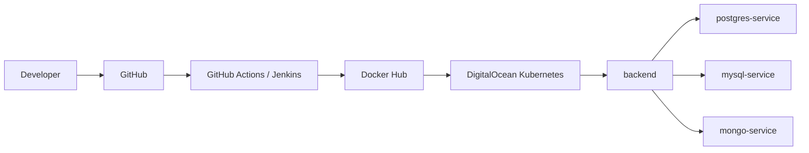
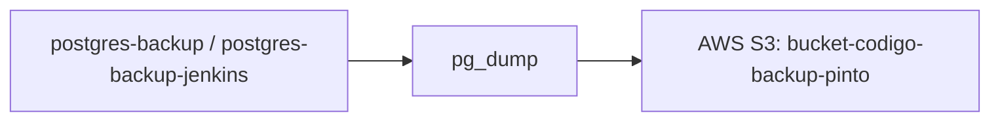
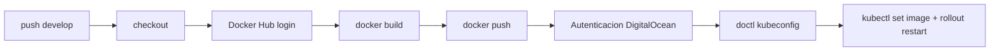
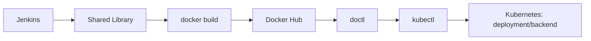

# Examen 3 DevOps

## 1. Descripcion

Este proyecto es un backend en Node.js. La idea principal es que la aplicacion pueda cambiar de base de datos usando la variable `MY_DATABASE_DRIVER`.

El backend tiene drivers para:

- PostgreSQL
- MySQL
- MongoDB

La API trabaja con usuarios y el codigo principal esta en `index.js`. Los drivers estan separados en la carpeta `drivers/`, asi que el backend no queda amarrado a un solo motor.

Tambien deje armado el flujo DevOps: Docker, Docker Compose, Kubernetes, Minikube, DigitalOcean Kubernetes, GitHub Actions, Jenkins, Terraform y backups hacia AWS S3.

## 2. Arquitectura

El flujo general queda asi: el codigo sale desde GitHub, pasa por GitHub Actions o Jenkins, se construye la imagen Docker, se publica en Docker Hub y finalmente Kubernetes actualiza el backend.



Para backups use un CronJob de Kubernetes. El job ejecuta `pg_dump` y sube el archivo a S3.



## 3. Tecnologias

Estas son las tecnologias que aparecen realmente en el proyecto:

| Parte           | Tecnologia                                      |
| --------------- | ----------------------------------------------- |
| Backend         | Node.js, Express                                |
| Base de datos   | PostgreSQL, MySQL, MongoDB                      |
| Contenedores    | Docker, Docker Compose, Docker Hub              |
| Kubernetes      | Kubernetes, Minikube, DigitalOcean Kubernetes   |
| CI/CD           | GitHub Actions, Jenkins, Jenkins Shared Library |
| Infraestructura | Terraform                                       |
| Backups         | AWS S3, AWS CLI, `pg_dump`                      |
| Herramientas    | `kubectl`, `doctl`                              |

## 4. Estructura del proyecto

Este es el arbol simplificado con los archivos importantes. No incluyo `node_modules` ni archivos innecesarios.

```text
.
├── .github/
│   └── workflows/
│       └── develop.yml
├── backup/
│   ├── Dockerfile
│   ├── Dockerfile.jenkins
│   ├── backup.sh
│   └── backup-jenkins.sh
├── data/
│   ├── database.js
│   ├── mongo.json
│   ├── mysql_data.sql
│   └── postgres_data.sql
├── drivers/
│   ├── mongoDriver.js
│   ├── mysqlDriver.js
│   └── postgresDriver.js
├── k8s/
│   ├── aws-secret.yml
│   ├── backend-deployment.yml
│   ├── backend-service.yml
│   ├── configmap.mongo.yml
│   ├── configmap.mysql.yml
│   ├── configmap.postgres.yml
│   ├── cronjob.yml
│   ├── cronjob-jenkins.yml
│   ├── mongo.yml
│   ├── mysql.yml
│   ├── namespace.yml
│   ├── postgres.yml
│   └── secret.yml
├── script/
│   └── initdb.sh
├── terraform/
│   ├── aws/
│   └── digitalocean/
│       ├── jenkins/
│       └── kubernetes/
├── vars/
│   └── deployBackend.groovy
├── Dockerfile
├── Jenkinsfile
├── docker-compose.yml
├── index.js
├── package.json
└── package-lock.json
```

Tomar en cuenta que algunas cosas viven en ramas especificas:

- En `develop` esta el workflow `.github/workflows/develop.yml`.
- En `modificador` esta el workflow manual `.github/workflows/modificador.yml`.
- En `jenkins` estan `Jenkinsfile`, `vars/deployBackend.groovy`, la configuracion del Droplet Jenkins y la variante de backup para Jenkins.

## 5. Docker

La imagen principal del backend se construye con el `Dockerfile` de la raiz. Usa `node:20-alpine`, instala dependencias con `npm install`, copia el proyecto y arranca con `npm start`.

Imagen principal:

```text
jeffrey7101/devopsexamen3:latest
```

Construir la imagen:

```bash
docker build -t jeffrey7101/devopsexamen3:latest .
```

Levantar localmente con Docker Compose:

```bash
docker compose up --build
```

El `docker-compose.yml` levanta dos servicios:

- `backend`, expuesto en el puerto `3000`.
- `db_examen3`, con la imagen `postgres:17`.

Publicar en Docker Hub:

```bash
docker login
docker push jeffrey7101/devopsexamen3:latest
```

Variables que usa el backend:

| Variable             | Para que la uso                      |
| -------------------- | ------------------------------------ |
| `MY_DATABASE_DRIVER` | Define el driver activo.             |
| `DB_HOST`            | Host o servicio de la base de datos. |
| `DB_USER_NAME`       | Usuario de la base de datos.         |
| `DB_PASSWORD`        | Password de la base de datos.        |
| `DB_NAME`            | Nombre de la base de datos.          |
| `DB_PORT`            | Puerto de conexion.                  |

Valores validos para `MY_DATABASE_DRIVER`:

```text
postgres
mysql
mongo
```

## 6. Kubernetes y Minikube

Los manifests estan en `k8s/` y usan el namespace `node-dynamic`.

El backend corre como Deployment llamado `backend`, con `replicas: 2`, y usa la imagen:

```text
jeffrey7101/devopsexamen3:latest
```

Los recursos principales son:

- `k8s/namespace.yml`: namespace `node-dynamic`.
- `k8s/backend-deployment.yml`: Deployment `backend`.
- `k8s/backend-service.yml`: Service `backend-service`.
- `k8s/secret.yml`: Secret `backend-secret`.
- `k8s/aws-secret.yml`: Secret `aws-secret`.
- `k8s/postgres.yml`: PostgreSQL y `postgres-service`.
- `k8s/mysql.yml`: MySQL y `mysql-service`.
- `k8s/mongo.yml`: MongoDB y `mongo-service`.
- `k8s/cronjob.yml`: CronJob `postgres-backup`.
- `k8s/cronjob-jenkins.yml`: CronJob `postgres-backup-jenkins`.

Para cambiar de base de datos no cambio el codigo. Cambio el ConfigMap `backend-config` y reinicio el Deployment.

| Driver     | Archivo                      | Servicio           | Puerto  |
| ---------- | ---------------------------- | ------------------ | ------- |
| PostgreSQL | `k8s/configmap.postgres.yml` | `postgres-service` | `5432`  |
| MySQL      | `k8s/configmap.mysql.yml`    | `mysql-service`    | `3306`  |
| MongoDB    | `k8s/configmap.mongo.yml`    | `mongo-service`    | `27017` |

Aplicar los manifests principales:

```bash
kubectl apply -f k8s/namespace.yml
kubectl apply -f k8s/secret.yml
kubectl apply -f k8s/aws-secret.yml
kubectl apply -f k8s/postgres.yml
kubectl apply -f k8s/mysql.yml
kubectl apply -f k8s/mongo.yml
kubectl apply -f k8s/configmap.postgres.yml
kubectl apply -f k8s/backend-deployment.yml
kubectl apply -f k8s/backend-service.yml
kubectl apply -f k8s/cronjob.yml
```

Cambiar manualmente a MySQL:

```bash
kubectl apply -f k8s/configmap.mysql.yml
kubectl rollout restart deployment/backend -n node-dynamic
kubectl rollout status deployment/backend -n node-dynamic
```

Cambiar manualmente a MongoDB:

```bash
kubectl apply -f k8s/configmap.mongo.yml
kubectl rollout restart deployment/backend -n node-dynamic
kubectl rollout status deployment/backend -n node-dynamic
```

Volver a PostgreSQL:

```bash
kubectl apply -f k8s/configmap.postgres.yml
kubectl rollout restart deployment/backend -n node-dynamic
kubectl rollout status deployment/backend -n node-dynamic
```

Para comprobar que quedo aplicado:

```bash
kubectl get configmap backend-config -n node-dynamic -o yaml
```

Tambien lo probe con Minikube antes de usar el cluster final.

```bash
minikube start
kubectl apply -f k8s/namespace.yml
kubectl apply -f k8s/secret.yml
kubectl apply -f k8s/aws-secret.yml
kubectl apply -f k8s/postgres.yml
kubectl apply -f k8s/mysql.yml
kubectl apply -f k8s/mongo.yml
kubectl apply -f k8s/configmap.postgres.yml
kubectl apply -f k8s/backend-deployment.yml
kubectl apply -f k8s/backend-service.yml
```

Comandos para revisar en Minikube:

```bash
kubectl get pods -n node-dynamic
kubectl get services -n node-dynamic
kubectl get deployment backend -n node-dynamic
```

Probar el backend con `port-forward`:

```bash
kubectl port-forward service/backend-service 3000:3000 -n node-dynamic
curl http://localhost:3000/
curl http://localhost:3000/users
```

## 7. DigitalOcean Kubernetes

Para no crear el cluster manualmente, use Terraform. La configuracion esta en:

```text
terraform/digitalocean/kubernetes/
```

Desde esa carpeta se crea el cluster de DigitalOcean Kubernetes:

- Recurso: `digitalocean_kubernetes_cluster.examen`
- Nombre: `devops-examen3`
- Region por defecto: `tor1`
- Node pool: `worker-pool`
- Tamano de nodo: `s-2vcpu-4gb`
- Cantidad de nodos: `1`

Comandos:

```bash
cd terraform/digitalocean/kubernetes
terraform init
terraform plan
terraform apply
```

Luego guardo el kubeconfig con `doctl`:

```bash
doctl kubernetes cluster kubeconfig save devops-examen3
kubectl get pods -n node-dynamic
```

El token de DigitalOcean va en la variable sensible `digitalocean_token`. No debe subirse al repositorio.

## 8. Rama develop

Para la rama `develop` use GitHub Actions. Cada vez que hago un push a esta rama, el workflow construye nuevamente la imagen, la publica en Docker Hub y actualiza el backend en Kubernetes.

El archivo es:

```text
.github/workflows/develop.yml
```



Comandos que ejecuta el workflow:

```bash
docker build -t jeffrey7101/devopsexamen3:latest .
docker push jeffrey7101/devopsexamen3:latest
doctl kubernetes cluster kubeconfig save devops-examen3
kubectl set image deployment/backend backend=jeffrey7101/devopsexamen3:latest -n node-dynamic
kubectl rollout restart deployment/backend -n node-dynamic
kubectl rollout status deployment/backend -n node-dynamic
```

Secrets que necesita GitHub Actions:

| Secret               | Uso                                        |
| -------------------- | ------------------------------------------ |
| `DOCKERHUB_USERNAME` | Usuario de Docker Hub.                     |
| `DOCKERHUB_TOKEN`    | Token/password de Docker Hub.              |
| `DIGITALOCEAN_TOKEN` | Token para `digitalocean/action-doctl@v2`. |

## 9. Rama modificador

La rama `modificador` la use para cambiar el driver desde GitHub Actions sin editar manualmente los manifests. Es un workflow manual con `workflow_dispatch`.

Archivo:

```text
.github/workflows/modificador.yml
```

Inputs reales:

| Input      | Tipo     | Valores                      |
| ---------- | -------- | ---------------------------- |
| `resource` | `string` | Default: `backend`           |
| `driver`   | `choice` | `postgres`, `mysql`, `mongo` |

Este workflow hace checkout, configura `doctl`, guarda el kubeconfig del cluster `devops-examen3`, aplica el ConfigMap del driver elegido y reinicia el recurso indicado.

Ejemplo:

```text
resource = backend
driver = mysql
```

Para comprobar el cambio:

```bash
kubectl get configmap backend-config -n node-dynamic -o yaml
kubectl get pods -n node-dynamic
```

## 10. Backups

Para los backups cree imagenes Docker separadas. Una se usa en el flujo de `develop` y otra en Jenkins, principalmente para dejar clara la diferencia entre ambos procesos.

Imagen de backup para `develop`:

```text
jeffrey7101/devopsexamen3-backup:latest
```

Imagen de backup para Jenkins:

```text
jeffrey7101/devopsexamen3-backup-jenkins:latest
```

Los Dockerfiles estan en `backup/`. Ambos usan `postgres:16`, instalan `awscli` y ejecutan un script que genera un dump con `pg_dump`.

| Archivo                   | CronJob                   | Imagen                                            | Frecuencia    |
| ------------------------- | ------------------------- | ------------------------------------------------- | ------------- |
| `k8s/cronjob.yml`         | `postgres-backup`         | `jeffrey7101/devopsexamen3-backup:latest`         | `0 */3 * * *` |
| `k8s/cronjob-jenkins.yml` | `postgres-backup-jenkins` | `jeffrey7101/devopsexamen3-backup-jenkins:latest` | `0 */3 * * *` |

Bucket usado:

```text
bucket-codigo-backup-pinto
```

Rutas donde se suben los backups:

```text
s3://bucket-codigo-backup-pinto/Pinto/database/<timestamp>/db_examen.sql
s3://bucket-codigo-backup-pinto/Pinto/database-jenkins/<timestamp>/db_examen.sql
```

Construir las imagenes:

```bash
docker build -t jeffrey7101/devopsexamen3-backup:latest -f backup/Dockerfile backup
docker build -t jeffrey7101/devopsexamen3-backup-jenkins:latest -f backup/Dockerfile.jenkins backup
```

Publicarlas:

```bash
docker push jeffrey7101/devopsexamen3-backup:latest
docker push jeffrey7101/devopsexamen3-backup-jenkins:latest
```

Probar manualmente el backup de `develop`:

```bash
kubectl create job --from=cronjob/postgres-backup postgres-backup-manual -n node-dynamic
kubectl logs job/postgres-backup-manual -n node-dynamic
```

Probar manualmente el backup de Jenkins:

```bash
kubectl create job --from=cronjob/postgres-backup-jenkins postgres-backup-jenkins-manual -n node-dynamic
kubectl logs job/postgres-backup-jenkins-manual -n node-dynamic
```

Las credenciales de AWS salen del Secret `aws-secret`. No deben ponerse credenciales reales en el README ni en commits.

## 11. AWS S3 + Terraform

Para crear el bucket de backups use Terraform. La configuracion esta en:

```text
terraform/aws/
```

Terraform crea este recurso:

```text
aws_s3_bucket.backup
```

Nombre real del bucket:

```text
bucket-codigo-backup-pinto
```

Region por defecto:

```text
us-east-1
```

Comandos:

```bash
cd terraform/aws
terraform init
terraform plan
terraform apply
```

El nombre del bucket no es generico porque en AWS S3 los nombres deben ser unicos a nivel global.

## 12. Jenkins

Para la rama `jenkins` use un pipeline de Jenkins. En vez de dejar todo el proceso dentro del `Jenkinsfile`, lo conecte con una Shared Library.

Archivos usados en esta parte:

- `Jenkinsfile`
- `vars/deployBackend.groovy`
- `terraform/digitalocean/jenkins/`
- `backup/Dockerfile.jenkins`
- `backup/backup-jenkins.sh`
- `k8s/cronjob-jenkins.yml`

El servidor Jenkins corre en un Droplet de DigitalOcean. Lo cree con Terraform desde:

```text
terraform/digitalocean/jenkins/
```

Datos del Droplet:

- Recurso: `digitalocean_droplet.jenkins`
- Nombre: `jenkins-examen3`
- Imagen: `ubuntu-24-04-x64`
- Region por defecto: `tor1`
- Tamano: `s-2vcpu-4gb`

El `user_data` instala Docker y `docker-compose-plugin`. Jenkins se trabajo sobre ese Droplet usando Docker y Docker Compose; en este repo esta la preparacion del servidor, pero no hay un `docker-compose.yml` especifico de Jenkins.

Credenciales configuradas en Jenkins:

| Credencial           | Tipo               | Uso                        |
| -------------------- | ------------------ | -------------------------- |
| `dockerhub`          | `usernamePassword` | Login y push a Docker Hub. |
| `digitalocean-token` | `string`           | Autenticacion con `doctl`. |

Flujo:



## 13. Shared Library

Para no meter toda la logica directamente en el `Jenkinsfile`, movi el proceso de despliegue a `vars/deployBackend.groovy` y lo registre en Jenkins como una Shared Library.

El `Jenkinsfile` carga la libreria asi:

```groovy
@Library('devops-library') _
```

Y luego ejecuta:

```groovy
deployBackend()
```

La funcion `deployBackend()` hace estas etapas:

| Stage                   | Que hace                                                                              |
| ----------------------- | ------------------------------------------------------------------------------------- |
| `Docker Build`          | Construye `jeffrey7101/devopsexamen3:latest`.                                         |
| `Docker Push`           | Usa la credencial `dockerhub` y publica la imagen.                                    |
| `Configurar Kubernetes` | Usa `digitalocean-token`, ejecuta `doctl` y guarda el kubeconfig de `devops-examen3`. |
| `Deploy Kubernetes`     | Actualiza la imagen del Deployment, reinicia `backend` y espera el rollout.           |

En Jenkins la libreria debe estar configurada como Global Trusted Pipeline Library con el nombre:

```text
devops-library
```

## 14. Terraform

Use Terraform para tres partes del examen:

| Recurso                                | Proveedor    | Carpeta                              |
| -------------------------------------- | ------------ | ------------------------------------ |
| Bucket S3 `bucket-codigo-backup-pinto` | AWS          | `terraform/aws/`                     |
| Cluster Kubernetes `devops-examen3`    | DigitalOcean | `terraform/digitalocean/kubernetes/` |
| Droplet `jenkins-examen3`              | DigitalOcean | `terraform/digitalocean/jenkins/`    |

Comandos base que se usan en cada carpeta:

```bash
terraform init
terraform plan
terraform apply
```

Variables sensibles:

- `digitalocean_token` para los recursos de DigitalOcean.
- Credenciales AWS para crear el bucket y para el Secret `aws-secret`.

## 15. Pruebas

Para revisar el estado del cluster use estos comandos:

```bash
kubectl get pods -n node-dynamic
kubectl get deployment backend -n node-dynamic
kubectl get cronjobs -n node-dynamic
kubectl get jobs -n node-dynamic
kubectl get services -n node-dynamic
kubectl get configmap backend-config -n node-dynamic -o yaml
```

Para revisar las replicas del backend:

```bash
kubectl get deployment backend -n node-dynamic
```

Segun `k8s/backend-deployment.yml`, el backend debe correr con 2 replicas.

Lo que se comprueba en la demo:

- Backend con 2 pods.
- PostgreSQL usando `postgres-service`.
- MySQL usando `mysql-service`.
- MongoDB usando `mongo-service`.
- Cambio dinamico de driver con ConfigMaps.
- Backup de `develop` con `postgres-backup`.
- Backup de Jenkins con `postgres-backup-jenkins`.
- Pipeline de GitHub Actions en `develop`.
- Workflow manual en `modificador`.
- Pipeline de Jenkins en `jenkins`.

## 16. Seguridad

En esta parte cuide principalmente no dejar secretos reales en el repositorio.

Puntos importantes:

- No versionar tokens, passwords ni Access Keys reales.
- `terraform.tfstate`, `*.tfstate.*` y `terraform.tfvars` estan ignorados.
- `.terraform/` esta ignorado.
- `k8s/aws-secret-local.yml` esta ignorado.
- `DB_PASSWORD` se maneja con el Secret `backend-secret`.
- Las credenciales AWS se manejan con `aws-secret`.
- GitHub Actions usa `DOCKERHUB_USERNAME`, `DOCKERHUB_TOKEN` y `DIGITALOCEAN_TOKEN`.
- Jenkins usa las credenciales `dockerhub` y `digitalocean-token`.

Antes de correrlo en un entorno real, los valores de ejemplo deben reemplazarse por secretos reales administrados desde Kubernetes, GitHub Actions o Jenkins.

## 17. Flujo de demostracion

Este es el orden que seguiria para presentar el examen:

1. Levantar backend y PostgreSQL con Docker Compose.
2. Construir y publicar `jeffrey7101/devopsexamen3:latest` en Docker Hub.
3. Probar los manifests con Minikube.
4. Crear el cluster `devops-examen3` en DigitalOcean Kubernetes con Terraform.
5. Aplicar los manifests en `node-dynamic`.
6. Mostrar el pipeline de GitHub Actions en `develop`.
7. Ejecutar el workflow manual de `modificador` cambiando `driver`.
8. Crear el bucket `bucket-codigo-backup-pinto` con Terraform.
9. Ejecutar o esperar el CronJob `postgres-backup`.
10. Crear el Droplet `jenkins-examen3` con Terraform.
11. Ejecutar el pipeline de Jenkins con Shared Library.
12. Ejecutar o esperar el backup `postgres-backup-jenkins`.

## 18. Comandos utiles

| Objetivo                 | Comando                                                                  |
| ------------------------ | ------------------------------------------------------------------------ |
| Ver pods                 | `kubectl get pods -n node-dynamic`                                       |
| Ver services             | `kubectl get services -n node-dynamic`                                   |
| Ver Deployment backend   | `kubectl get deployment backend -n node-dynamic`                         |
| Ver ConfigMap activo     | `kubectl get configmap backend-config -n node-dynamic -o yaml`           |
| Reiniciar backend        | `kubectl rollout restart deployment/backend -n node-dynamic`             |
| Estado del rollout       | `kubectl rollout status deployment/backend -n node-dynamic`              |
| Ver CronJobs             | `kubectl get cronjobs -n node-dynamic`                                   |
| Ver Jobs                 | `kubectl get jobs -n node-dynamic`                                       |
| Logs de un Job           | `kubectl logs job/<job-name> -n node-dynamic`                            |
| Port-forward del backend | `kubectl port-forward service/backend-service 3000:3000 -n node-dynamic` |
| Probar raiz              | `curl http://localhost:3000/`                                            |
| Probar usuarios          | `curl http://localhost:3000/users`                                       |

## Autor

Jeffrey Pinto
